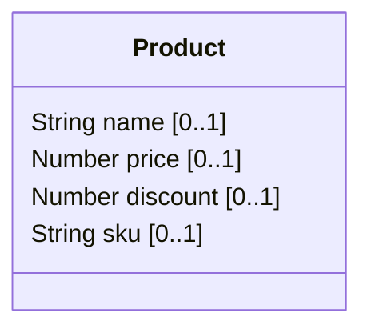
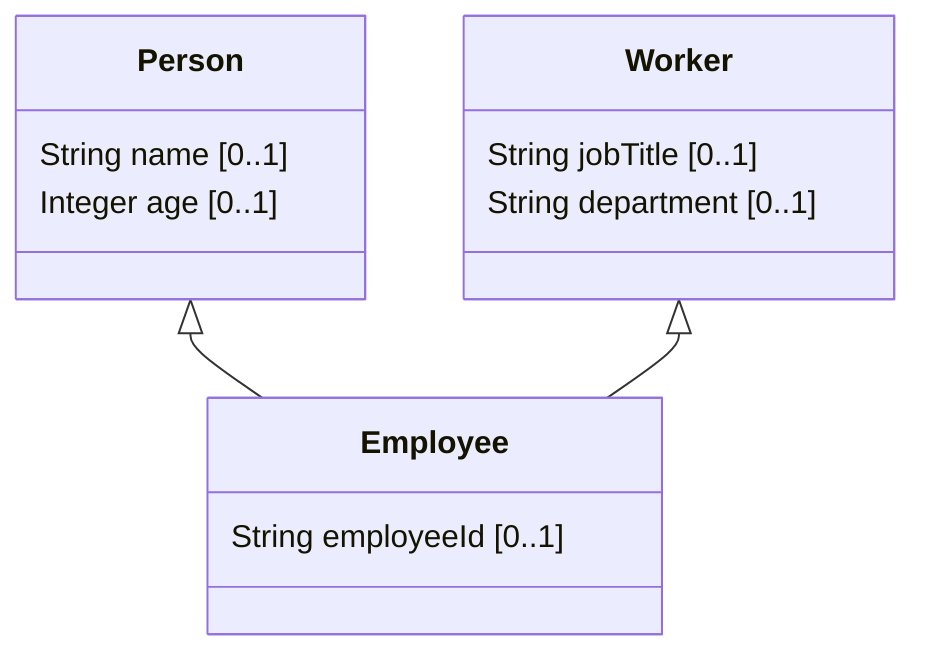
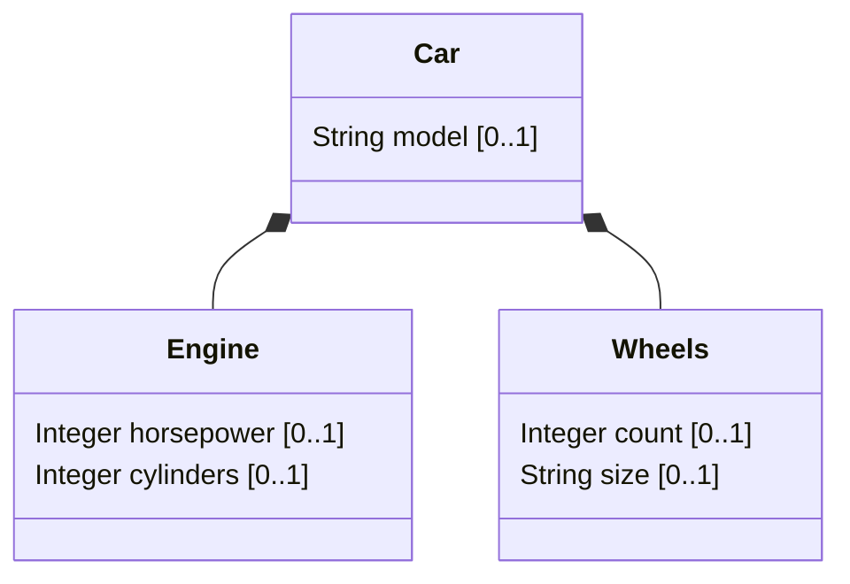

# AllOf Mode Implementation - Complete

## Summary

Successfully implemented the Open Spec specification for Composition Visualization Options (`--allof-mode`) with all tests passing.

## Implementation Details

### 1. Core Types (`MermaidGeneratorTypes.kt`)
- Added `AllOfMode` enum with three modes:
  - `MERGE` (default) - Merges all allOf fields into the current class
  - `INHERIT` - Treats allOf objects as parent classes (draws `<|--` inheritance arrows)
  - `COMPOSE` - Treats allOf objects as components (draws `*--` composition arrows)
- Updated `Preferences` data class to include `allOfMode: AllOfMode = AllOfMode.MERGE`

### 2. Schema Model (`Schema.kt`)
- Added `allOf: List<Property>? = null` field to the `Schema` data class to support schema-level allOf composition

### 3. CLI Integration (`App.kt`, `CliOptions.kt`)
- Added `--allof-mode` CLI option accepting: merge, inherit, or compose (case-insensitive)
- Added `allOfModeOption: String?` field to `CliOptions`

### 4. Preferences Builder (`PreferencesBuilder.kt`)
- Added `resolveAllOfMode()` method to resolve allOf mode from CLI or config file
- Added `parseAllOfMode()` method with proper validation
- CLI takes precedence over config file
- Invalid values throw `InvalidOptionException` with clear error messages

### 5. Composition Handler (`CompositionKeywordHandler.kt`)
- Refactored to support all three modes:
  - `handleAllOfMerge()` - Original behavior, merges properties inline
  - `handleAllOfInherit()` - Draws inheritance relationships (`Parent <|-- Child`)
  - `handleAllOfCompose()` - Draws composition relationships (`Container *-- Component`)
- Proper null handling and graceful fallbacks for non-standard schemas

### 6. Schema Processing (`TopLevelSchemaProcessor.kt`)
- Added schema-level allOf handling in `processTopLevelSchema()`
- Created `handleSchemaLevelAllOf()` method to process allOf at the schema root level
- Ensures allOf composition patterns are correctly identified and processed

## Test Coverage

### Unit Tests (`PreferencesBuilderTest.kt`) - 12 tests total
- CLI arrays tests (5 original tests)
- CLI allOfMode parsing tests (7 new tests):
  - merge, inherit, compose value handling
  - Invalid value error handling
  - Config file integration
  - Default value verification

### Integration Tests (`AllOfModeTest.kt`) - 6 tests
- allOf merge mode verification
- allOf inherit mode verification
- allOf compose mode verification
- Reference-based relationship tests
- Default mode behavior

### CLI Tests (`AppAllOfModeCliTest.kt`) - 5 tests
- Default mode (merge) behavior
- --allof-mode merge flag
- --allof-mode inherit flag
- --allof-mode compose flag
- Case-insensitive value handling

### Test Schemas Created
- `allof_merge.schema.json` - Product with BaseProduct reference and inline properties
- `allof_inherit.schema.json` - Employee inheriting from Person and Worker
- `allof_compose.schema.json` - Car composed of Engine and Wheels

## Test Results

```
✓ All 70 tests passing
✓ Build successful
✓ No compilation errors
✓ Backward compatible (default is merge mode)
```

## Verified Behavior

### Merge Mode (default)

All fields from allOf are merged into the Product class.

### Inherit Mode

Inheritance arrows show Employee extends both Person and Worker.

### Compose Mode

Composition arrows show Car is composed of Engine and Wheels.

## Spec Compliance

✅ CLI flag `--allof-mode` implemented
✅ Config file option `allOfMode` supported
✅ Three modes: merge, inherit, compose
✅ Case-insensitive value handling
✅ Error messages for invalid values
✅ CLI precedence over config file
✅ Backward compatibility (default = merge)
✅ Comprehensive test coverage
✅ All existing tests still pass

## Files Modified

1. `src/main/kotlin/jsonschema_to_mermaid/diagram/MermaidGeneratorTypes.kt`
2. `src/main/kotlin/jsonschema_to_mermaid/jsonschema/Schema.kt`
3. `src/main/kotlin/jsonschema_to_mermaid/cli/App.kt`
4. `src/main/kotlin/jsonschema_to_mermaid/cli/CliOptions.kt`
5. `src/main/kotlin/jsonschema_to_mermaid/cli/PreferencesBuilder.kt`
6. `src/main/kotlin/jsonschema_to_mermaid/relationship/CompositionKeywordHandler.kt`
7. `src/main/kotlin/jsonschema_to_mermaid/schema/TopLevelSchemaProcessor.kt`

## Files Created

1. `src/test/kotlin/jsonschema_to_mermaid/AllOfModeTest.kt`
2. `src/test/kotlin/jsonschema_to_mermaid/cli/AppAllOfModeCliTest.kt`
3. `src/test/resources/core/allof_merge.schema.json`
4. `src/test/resources/core/allof_inherit.schema.json`
5. `src/test/resources/core/allof_compose.schema.json`
6. `src/test/kotlin/test_manual/TestAllOfModes.kt` (manual testing utility)

## Implementation Complete ✓

The feature is fully implemented, tested, and ready for use.

