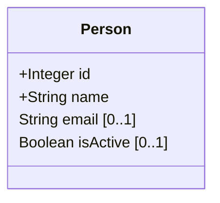
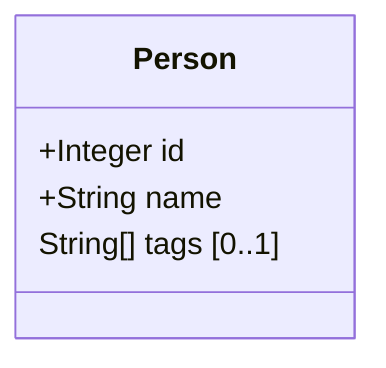
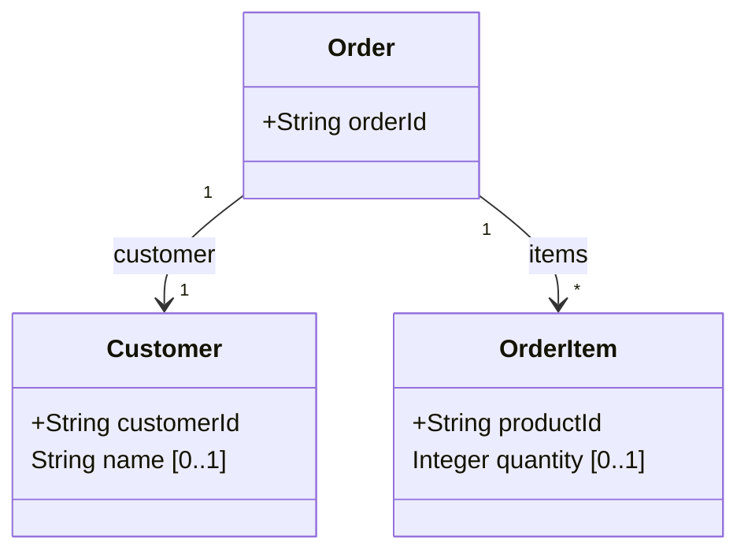
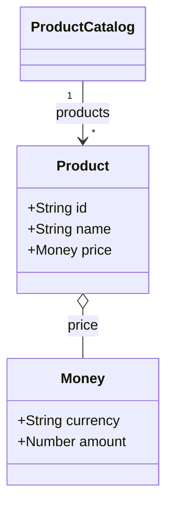
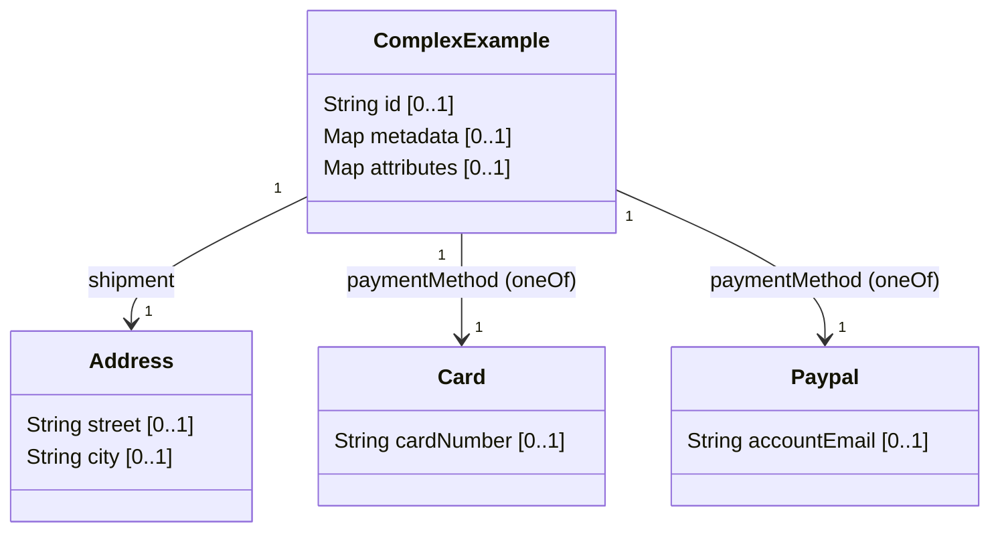
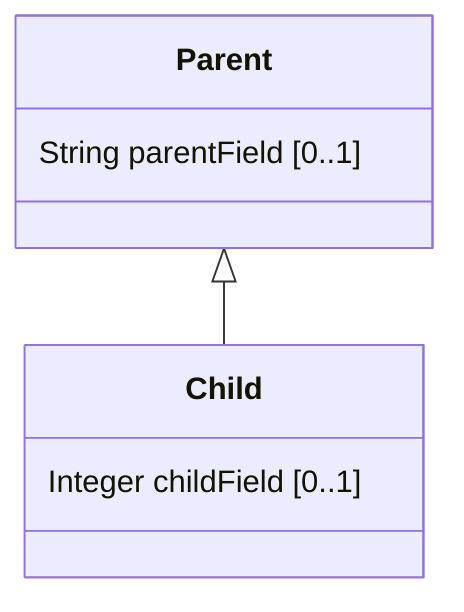

# Mermaid ClassDiagram Generator

**Mermaid ClassDiagram Generator** is a command-line tool that converts
[JSON Schema](https://json-schema.org/understanding-json-schema/about) (JSON or YAML) files  into
[Mermaid](https://mermaid-js.github.io/) class diagrams.
This helps you visualize data models, document APIs, and understand complex schema structures quickly and easily.

## Usage

You can run the generator directly from the command line. The tool reads a JSON Schema file and outputs a Mermaid class
diagram to standard output or a file.

### Basic usage

```sh
jsonschema-to-mermaid [OPTIONS] <source> [<output>]
```

- `<source>`: Path to the input JSON Schema file or directory (JSON or YAML).
- `<output>`: (Optional) Path to write the generated Mermaid diagram. If omitted, output is printed to stdout.

### Options

| Option                | Description                                      |
|-----------------------|--------------------------------------------------|
| -o, --output FILE     | Write output to FILE instead of stdout           |
| -r, --root NAME       | Use NAME as the root definition                  |
| --no-header           | Suppress the Mermaid header in output            |
| -h, --help            | Show help message and exit                       |
| -V, --version         | Show version information and exit                |

### Example

```sh
jsonschema-to-mermaid examples/bookstore/bookstore.schema.json -o bookstore.mmd
```

This command reads the `bookstore.schema.json` file and writes the generated Mermaid diagram to `bookstore.mmd`.

You can also specify a root definition and suppress the header:

```sh
jsonschema-to-mermaid -r Bookstore --no-header examples/bookstore/bookstore.schema.json -o bookstore.mmd
```

## Examples

This README includes progressive examples showing input JSON Schemas (both JSON and YAML) and the expected Mermaid class diagram output. Required fields are prefixed with `+`. Optional fields include a UML-style cardinality suffix `[0..1]`.

### 1) Simple: Person (JSON)
Input (person.schema.json):

```json
{
  "$schema": "http://json-schema.org/draft-07/schema#",
  "title": "Person",
  "type": "object",
  "properties": {
    "id": { "type": "integer" },
    "name": { "type": "string" },
    "email": { "type": "string", "format": "email" },
    "isActive": { "type": "boolean", "default": true }
  },
  "required": ["id", "name"]
}
```

Generated Mermaid:



### 2) Simple: Person (YAML)
Input (person.schema.yaml):

```yaml
$schema: "http://json-schema.org/draft-07/schema#"
title: Person
type: object
properties:
  id:
    type: integer
  name:
    type: string
  tags:
    type: array
    items:
      type: string
required:
  - id
  - name
```

Generated Mermaid:



### 3) Nested Objects and Arrays
Input (order.schema.json):

```json
{
  "$schema": "http://json-schema.org/draft-07/schema#",
  "title": "Order",
  "type": "object",
  "properties": {
    "orderId": { "type": "string" },
    "customer": {
      "type": "object",
      "properties": {
        "customerId": { "type": "string" },
        "name": { "type": "string" }
      },
      "required": ["customerId"]
    },
    "items": {
      "type": "array",
      "items": {
        "type": "object",
        "properties": {
          "productId": { "type": "string" },
          "quantity": { "type": "integer" }
        },
        "required": ["productId"]
      }
    }
  },
  "required": ["orderId", "customer", "items"]
}
```

Generated Mermaid:



### 4) References ($ref), Reuse and Enums
Input (product-catalog.schema.yaml):

```yaml
$schema: http://json-schema.org/draft-07/schema#
title: ProductCatalog
type: object
definitions:
  money:
    type: object
    properties:
      currency:
        type: string
        enum: [USD, EUR, GBP]
      amount:
        type: number
    required: [currency, amount]
  product:
    type: object
    properties:
      id:
        type: string
      name:
        type: string
      price:
        $ref: '#/definitions/money'
    required: [id, name, price]
properties:
  products:
    type: array
    items:
      $ref: '#/definitions/product'
```

Generated Mermaid:



### 5) Complex: Composition (allOf, anyOf, oneOf), additionalProperties, patternProperties
Input (complex.schema.json):

```json
{
  "$schema": "http://json-schema.org/draft-07/schema#",
  "title": "ComplexExample",
  "type": "object",
  "properties": {
    "id": { "type": "string" },
    "metadata": {
      "type": "object",
      "additionalProperties": { "type": "string" }
    },
    "attributes": {
      "type": "object",
      "patternProperties": {
        "^attr_": { "type": "number" }
      }
    },
    "shipment": {
      "allOf": [
        { "$ref": "#/definitions/address" },
        { "type": "object", "properties": { "eta": { "type": "string", "format": "date-time" } } }
      ]
    },
    "paymentMethod": {
      "oneOf": [
        { "$ref": "#/definitions/card" },
        { "$ref": "#/definitions/paypal" }
      ]
    }
  },
  "definitions": {
    "address": {
      "type": "object",
      "properties": {
        "street": { "type": "string" },
        "city": { "type": "string" }
      }
    },
    "card": {
      "type": "object",
      "properties": {
        "cardNumber": { "type": "string" }
      }
    },
    "paypal": {
      "type": "object",
      "properties": {
        "accountEmail": { "type": "string", "format": "email" }
      }
    }
  }
}
```

Generated Mermaid:



### 6) Inheritance with `extends`
Input (parent.schema.yaml):

```yaml
$id: parent.schema.yaml
$schema: https://json-schema.org/draft/2020-12/schema
title: Parent
properties:
  parentField:
    type: string
```

Input (child.schema.yaml):

```yaml
$id: child.schema.yaml
$schema: https://json-schema.org/draft/2020-12/schema
title: Child
extends:
  $ref: parent.schema.yaml
properties:
  childField:
    type: integer
```

Generated Mermaid:



### Tips for reading these examples
- `+` indicates a required field.
- `[0..1]` indicates an optional field (may be absent).
- Arrays may be shown as X[] or as relationships with multiplicity "*".
- Inline anonymous objects are often pulled out into named classes by the generator.
- `$ref` leads to class reuse and may produce aggregation (`o--`) or association (`-->`).

## Limitations

- **patternProperties**: Only the first pattern is used for type inference in the generated Mermaid diagram. If multiple patterns are present, only one will be reflected in the field type (e.g., `Map<String,Number>`). Distinct visualization for multiple patterns is not currently supported.

## Contributing examples
If you add additional examples, please include:
- the input schema file (JSON or YAML)
- the expected Mermaid markdown output
- a short note explaining noteworthy mapping decisions (e.g., how oneOf should be shown)
