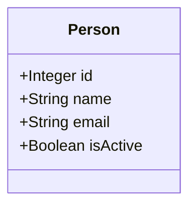
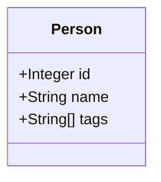
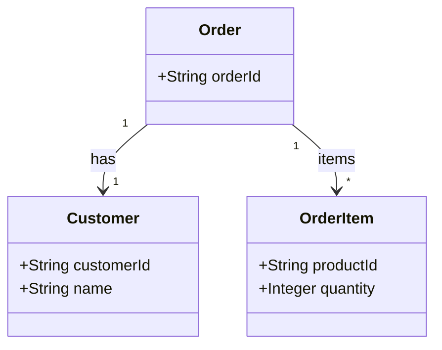
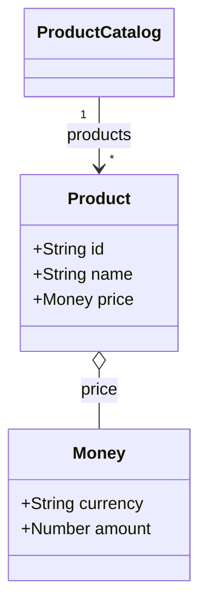
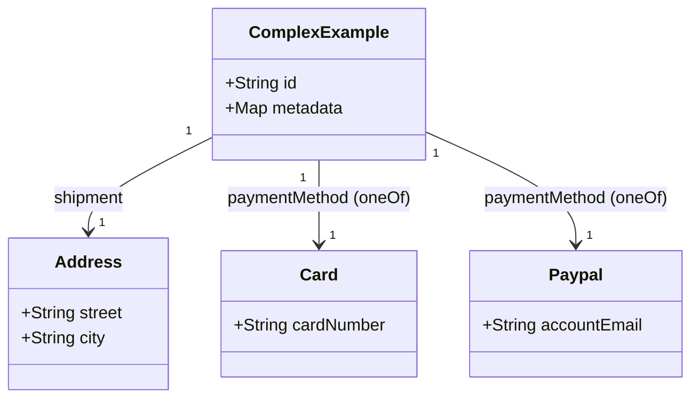

# Mermaid ClassDiagram Generator
Generates Mermaid class diagrams from JsonSchema files


## Examples

This README includes progressive examples showing input JSON Schemas (both JSON and YAML) and the expected Mermaid class diagram output. Start with a very simple schema and move to more complex patterns (nested objects, arrays, $ref, allOf/oneOf/anyOf, enums, patternProperties, and additionalProperties).

Each example shows:
- The input schema (JSON or YAML)
- The generated Mermaid diagram (as a Markdown fenced block with ```mermaid```) that this project aims to produce


### 1) Simple: Person (JSON)
Input (person.schema.json):

```json
{
  "$schema": "http://json-schema.org/draft-07/schema#",
  "title": "Person",
  "type": "object",
  "properties": {
    "id": { "type": "integer" },
    "name": { "type": "string" },
    "email": { "type": "string", "format": "email" },
    "isActive": { "type": "boolean", "default": true }
  },
  "required": ["id", "name"]
}
```

Generated Mermaid:



Notes: primitive types map to simple class fields. Required fields are typically shown as non-optional; optional fields can be annotated or omitted depending on tooling preferences.


### 2) Simple: Person (YAML)
Input (person.schema.yaml):

```yaml
$schema: "http://json-schema.org/draft-07/schema#"
title: Person
type: object
properties:
  id:
    type: integer
  name:
    type: string
  tags:
    type: array
    items:
      type: string
required:
  - id
  - name
```

Generated Mermaid:



Notes: arrays are represented as a field with a trailing [] or as relationships to a separate class representing the item type depending on settings.


### 3) Nested Objects and Arrays
Input (order.schema.json):

```json
{
  "$schema": "http://json-schema.org/draft-07/schema#",
  "title": "Order",
  "type": "object",
  "properties": {
    "orderId": { "type": "string" },
    "customer": {
      "type": "object",
      "properties": {
        "customerId": { "type": "string" },
        "name": { "type": "string" }
      },
      "required": ["customerId"]
    },
    "items": {
      "type": "array",
      "items": {
        "type": "object",
        "properties": {
          "productId": { "type": "string" },
          "quantity": { "type": "integer" }
        },
        "required": ["productId"]
      }
    }
  },
  "required": ["orderId", "customer", "items"]
}
```

Generated Mermaid (example showing classes and relationships):



Notes: The generator may choose to extract inline object/array item schemas into named classes (e.g., OrderItem) and show cardinalities.


### 4) References ($ref), Reuse and Enums
Input (product-catalog.schema.yaml):

```yaml
$schema: http://json-schema.org/draft-07/schema#
title: ProductCatalog
type: object
definitions:
  money:
    type: object
    properties:
      currency:
        type: string
        enum: [USD, EUR, GBP]
      amount:
        type: number
    required: [currency, amount]
  product:
    type: object
    properties:
      id:
        type: string
      name:
        type: string
      price:
        $ref: '#/definitions/money'
    required: [id, name, price]
properties:
  products:
    type: array
    items:
      $ref: '#/definitions/product'
```

Generated Mermaid:



Notes: $ref leads to class reuse. Enums can be shown either as a note on the field or as a separate enumerated type.


### 5) Complex: Composition (allOf, anyOf, oneOf), additionalProperties, patternProperties
Input (complex.schema.json):

```json
{
  "$schema": "http://json-schema.org/draft-07/schema#",
  "title": "ComplexExample",
  "type": "object",
  "properties": {
    "id": { "type": "string" },
    "metadata": {
      "type": "object",
      "additionalProperties": { "type": "string" }
    },
    "attributes": {
      "type": "object",
      "patternProperties": {
        "^attr_": { "type": "number" }
      }
    },
    "shipment": {
      "allOf": [
        { "$ref": "#/definitions/address" },
        { "type": "object", "properties": { "eta": { "type": "string", "format": "date-time" } } }
      ]
    },
    "paymentMethod": {
      "oneOf": [
        { "$ref": "#/definitions/card" },
        { "$ref": "#/definitions/paypal" }
      ]
    }
  },
  "definitions": {
    "address": {
      "type": "object",
      "properties": {
        "street": { "type": "string" },
        "city": { "type": "string" }
      }
    },
    "card": {
      "type": "object",
      "properties": {
        "cardNumber": { "type": "string" }
      }
    },
    "paypal": {
      "type": "object",
      "properties": {
        "accountEmail": { "type": "string", "format": "email" }
      }
    }
  }
}
```

Generated Mermaid (illustrative):



Notes: Composition keywords like allOf/oneOf/anyOf can be represented as inheritance, composition or alternatives depending on visual preferences. additionalProperties and patternProperties are shown as maps or notes.


### Tips for reading these examples
- Field types shown (String, Integer, Number, Boolean) are human-friendly mappings from JSON Schema types.
- Arrays may be shown as X[] or as relationships with multiplicity "*".
- Inline anonymous objects are often pulled out into named classes by the generator for clarity.
- The project tries to preserve schema structure and reuse when $ref is present.


## Usage

See the project scripts in `build/scripts` or the generated CLI in `build/scripts/jsonschema-to-mermaid` for how to run this generator against a schema file and get Mermaid markdown as output.


## Contributing examples
If you add additional examples, please include:
- the input schema file (JSON or YAML)
- the expected Mermaid markdown output
- a short note explaining noteworthy mapping decisions (e.g., how oneOf should be shown)
