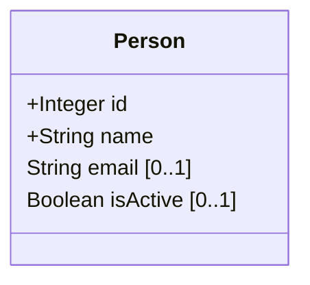
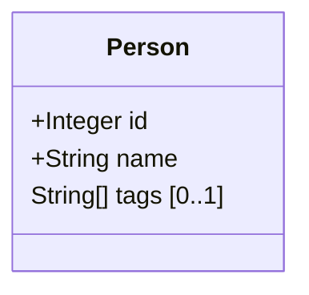
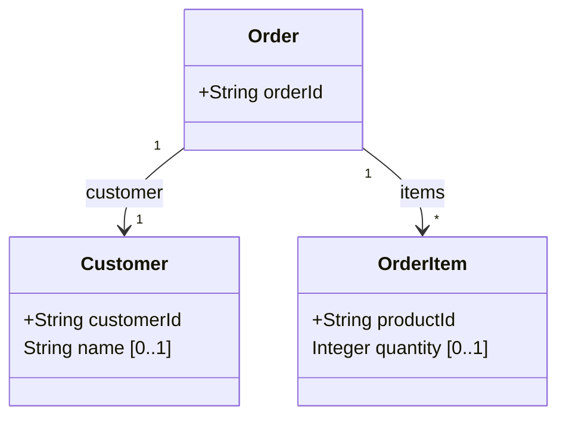
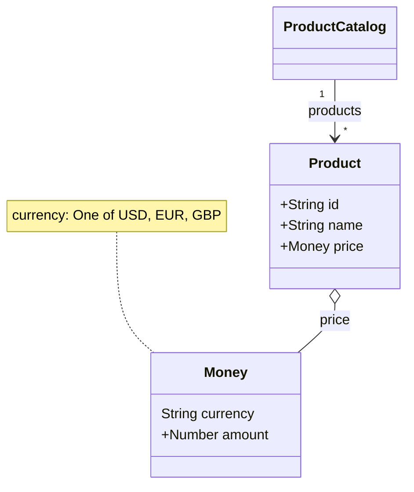
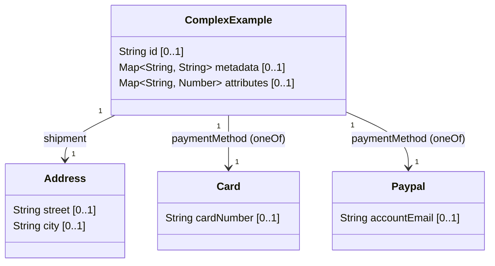
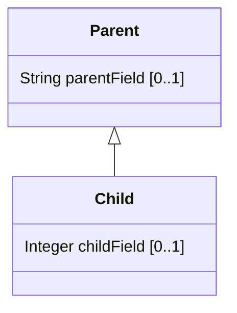

# Mermaid ClassDiagram Generator

**Mermaid ClassDiagram Generator** is a command-line tool that converts
[JSON Schema](https://json-schema.org/understanding-json-schema/about) (JSON or YAML) files into
[Mermaid](https://mermaid-js.github.io/) class diagrams.
This helps you visualize data models, document APIs, and understand complex schema structures quickly and easily.

## Usage

You can run the generator from the command line. It reads one or more JSON Schema files and outputs a Mermaid class
diagram to standard output or a file.

### Usage

```sh
jsonschema-to-mermaid [OPTIONS] [<source>] [<output>]
```

- `<source>`: (optional) Input schema file or directory. If omitted, all schema files in the current directory are used.
- `<output>`: (optional) Output file. If omitted, output is printed to stdout.

**Options:**

- `-s, --source FILE`      Input schema file (relative to directory or CWD)
- `-d, --source-dir DIR`   Directory with schema files (default: current directory)
- `-o, --output FILE`      Output file
- `--enum-style STYLE`     Enum rendering style: `inline` (default), `note`, or `class`
- `-h, --help`             Show help
- `-V, --version`          Show version
- `--no-classdiagram-header`  Suppress the `classDiagram` header in Mermaid output. Useful for embedding the diagram
  body in a larger Mermaid document or when the header is added automatically by another tool.

**Behavior:**

- If both `--source` and `--source-dir` are set, the file is taken from the directory.
- If only `--source-dir` is set, all schema files in that directory are used.
- If only `--source` is set, the file is taken from the current directory.
- If neither is set, and `<source>` is given, it is used as file or directory.
- If nothing is set, all schema files in the current directory are used.

## Examples

This README includes progressive examples showing input JSON Schemas (both JSON and YAML) and the expected Mermaid class
diagram output. Required fields are prefixed with `+`. Optional fields include a UML-style cardinality suffix `[0..1]`.

### 1) Simple: Person (JSON)

Input (person.schema.json):

```json
{
  "$schema": "http://json-schema.org/draft-07/schema#",
  "title": "Person",
  "type": "object",
  "properties": {
    "id": {
      "type": "integer"
    },
    "name": {
      "type": "string"
    },
    "email": {
      "type": "string",
      "format": "email"
    },
    "isActive": {
      "type": "boolean",
      "default": true
    }
  },
  "required": [
    "id",
    "name"
  ]
}
```

Generated Mermaid:



### 2) Simple: Person (YAML)

Input (person.schema.yaml):

```yaml
$schema: "http://json-schema.org/draft-07/schema#"
title: Person
type: object
properties:
  id:
    type: integer
  name:
    type: string
  tags:
    type: array
    items:
      type: string
required:
  - id
  - name
```

Generated Mermaid:



### 3) Nested Objects and Arrays

Input (order.schema.json):

```json
{
  "$schema": "http://json-schema.org/draft-07/schema#",
  "title": "Order",
  "type": "object",
  "properties": {
    "orderId": {
      "type": "string"
    },
    "customer": {
      "type": "object",
      "properties": {
        "customerId": {
          "type": "string"
        },
        "name": {
          "type": "string"
        }
      },
      "required": [
        "customerId"
      ]
    },
    "items": {
      "type": "array",
      "items": {
        "type": "object",
        "properties": {
          "productId": {
            "type": "string"
          },
          "quantity": {
            "type": "integer"
          }
        },
        "required": [
          "productId"
        ]
      }
    }
  },
  "required": [
    "orderId",
    "customer",
    "items"
  ]
}
```

Generated Mermaid:



### 4) References ($ref), Reuse and Enums

Input (product-catalog.schema.yaml):

```yaml
$schema: http://json-schema.org/draft-07/schema#
title: ProductCatalog
type: object
definitions:
  money:
    type: object
    properties:
      currency:
        type: string
        enum: [ USD, EUR, GBP ]
      amount:
        type: number
    required: [ currency, amount ]
  product:
    type: object
    properties:
      id:
        type: string
      name:
        type: string
      price:
        $ref: '#/definitions/money'
    required: [ id, name, price ]
properties:
  products:
    type: array
    items:
      $ref: '#/definitions/product'
```

Generated Mermaid:



### 5) Complex: Composition (allOf, anyOf, oneOf), additionalProperties, patternProperties

Input (complex.schema.json):

```json
{
  "$schema": "http://json-schema.org/draft-07/schema#",
  "title": "ComplexExample",
  "type": "object",
  "properties": {
    "id": {
      "type": "string"
    },
    "metadata": {
      "type": "object",
      "additionalProperties": {
        "type": "string"
      }
    },
    "attributes": {
      "type": "object",
      "patternProperties": {
        "^attr_": {
          "type": "number"
        }
      }
    },
    "shipment": {
      "allOf": [
        {
          "$ref": "#/definitions/address"
        },
        {
          "type": "object",
          "properties": {
            "eta": {
              "type": "string",
              "format": "date-time"
            }
          }
        }
      ]
    },
    "paymentMethod": {
      "oneOf": [
        {
          "$ref": "#/definitions/card"
        },
        {
          "$ref": "#/definitions/paypal"
        }
      ]
    }
  },
  "definitions": {
    "address": {
      "type": "object",
      "properties": {
        "street": {
          "type": "string"
        },
        "city": {
          "type": "string"
        }
      }
    },
    "card": {
      "type": "object",
      "properties": {
        "cardNumber": {
          "type": "string"
        }
      }
    },
    "paypal": {
      "type": "object",
      "properties": {
        "accountEmail": {
          "type": "string",
          "format": "email"
        }
      }
    }
  }
}
```

Generated Mermaid:



### 6) Inheritance with `extends`

Input (parent.schema.yaml):

```yaml
$id: parent.schema.yaml
$schema: https://json-schema.org/draft/2020-12/schema
title: Parent
properties:
  parentField:
    type: string
```

Input (child.schema.yaml):

```yaml
$id: child.schema.yaml
$schema: https://json-schema.org/draft/2020-12/schema
title: Child
extends:
  $ref: parent.schema.yaml
properties:
  childField:
    type: integer
```

Generated Mermaid:



### Tips for reading these examples

- `+` indicates a required field.
- `[0..1]` indicates an optional field (may be absent).
- Arrays may be shown as X[] or as relationships with multiplicity "*".
- Inline anonymous objects are often pulled out into named classes by the generator.
- `$ref` leads to class reuse and may produce aggregation (`o--`) or association (`-->`).
- Enums are rendered inline by default. Use `--enum-style note` or `--enum-style class` for alternative representations.

## Enum Rendering Styles

You can control how enum values appear using the `--enum-style` flag:

1. Inline (default): Field type becomes `String status` with a note for enum values.
   ```mermaid
   classDiagram
   class Example {
     +String status
   }
   note for Example "status: One of A, B, C"
   ```
   CLI: `jsonschema-to-mermaid schema.json --enum-style inline`

2. Note: Field rendered normally; enum values added as a Mermaid note attached to the class.
   ```mermaid
   classDiagram
   class Example {
     +String status
   }
   note for Example "status: A, B, C"
   ```
   CLI: `jsonschema-to-mermaid schema.json --enum-style note`

3. Class: Separate `<<enumeration>>` class with each value as a literal.
   ```mermaid
   classDiagram
   class Example {
     +StatusEnum status
   }
   class StatusEnum {
     A
     B
     C
   }
   <<enumeration>> StatusEnum
   ```
   CLI: `jsonschema-to-mermaid schema.json --enum-style class`

## Limitations

- **patternProperties**: Only the first pattern is used for type inference in the generated Mermaid diagram. If multiple
  patterns are present, only one will be reflected in the field type (e.g., `Map~String, Number~ attributes [0..1]`).
  Distinct visualization for multiple patterns is not currently supported.
- **Enums**: Only string/number enums are supported. Complex enum types (objects, arrays) are not rendered.
- **Composition (`allOf`, `anyOf`, `oneOf`)**:
    - `allOf` is treated as inheritance if all segments are objects; otherwise, only the first object segment is merged.
    - `anyOf`/`oneOf` are visualized as multiple possible relations, but do not generate union types or polymorphic
      classes.
- **External `$ref`**: Only local file and same-directory references are supported. References to external files (other
  directories or HTTP URLs) are not resolved.
- **Name Collisions**: If two schemas sanitize to the same class name, the tool may produce duplicate or conflicting
  class names. Disambiguation is not yet implemented (see checklist).
- **Array Item Naming**: Plural-to-singular conversion is naive (drops trailing `s`). Irregular plurals are not handled.
- **Inheritance**: Only single inheritance is supported. Multiple inheritance via `allOf` is not merged if more than one
  object segment is present.
- **Format**: The `format` keyword is not mapped to special types (e.g., `date-time` remains `String`).
- **AdditionalProperties**: Rendered as a field with type `Map~String, Type~` (e.g.,
  `Map~String, String~ metadata [0..1]`), since Mermaid now supports this notation for generic types.
- **Other Limitations**: Some advanced features of JSON Schema (2020-12 and later) are not supported. See issue tracker
  for up-to-date status.
- **Unsupported Keywords**: The following JSON Schema keywords are not supported and will be ignored or may cause
  incomplete diagrams:
    - `not`
    - `if` / `then` / `else`
    - `dependentSchemas`, `dependentRequired`
    - `$defs` (2020-12 draft)
    - `unevaluatedProperties`, `additionalItems`
    - `const`, `contains`, `propertyNames`

## Contributing examples

If you add additional examples, please include:

- the input schema file (JSON or YAML)
- the expected Mermaid markdown output
- a short note explaining noteworthy mapping decisions (e.g., how oneOf should be shown)
