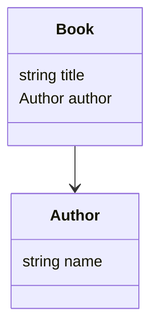

# Agent brief: JSONSchema-to-Mermaid

## Purpose

Provide a compact, human-friendly explanation of this repository's goal so an automated agent (or a new contributor) can quickly understand intent and act on tasks.

## Project Goal

Convert JSON Schema (and YAML Schema variants) into Mermaid diagrams (class diagrams, entity relationship-like diagrams)
to help visualize schema structure, relationships, and types. Support both single-file and multi-file schemas, resolve $
ref references (local, file-based, and HTTP/remote), and produce readable Mermaid output usable in documentation and
README previews.

## Primary Inputs and Outputs

- **Inputs**: JSON Schema or YAML files from `src/test/resources` (for tests) or arbitrary file paths (CLI). Accepts both single-file schemas and folders containing multiple schema files.
- **Outputs**: Mermaid diagram text (stdout or file), test reports under `build/reports`.
- **Error modes**: malformed JSON/YAML, unresolved $ref, recursive references, unsupported schema features. The tool fails with informative messages and non-zero exit code.

## How to Contribute

- Improve/refactor schema parsing and $ref resolution.
- Add new Mermaid diagram types (e.g., sequence or flow diagrams) or styling options.
- Harden CLI error handling and add more tests covering edge cases.
- Update documentation and add examples for README.

## Quick Start

This is a Kotlin/Gradle single-project build.

### Build and Test

```shell
./gradlew build      # Build the project
./gradlew test       # Run tests
```

### Run the CLI

```shell
# Using the fat JAR (recommended)
java -jar build/libs/jsonschema-to-mermaid-0.1.0.jar src/test/resources/bookstore/bookstore.schema.json

# Or via Gradle
./gradlew run --args="src/test/resources/bookstore/bookstore.schema.json"
```

The CLI prints Mermaid to stdout by default. Redirect to save to a file:

```shell
java -jar build/libs/jsonschema-to-mermaid-0.1.0.jar src/test/resources/bookstore/bookstore.schema.json > bookstore.mmd
```

## Expected Output Example

Given a simple schema with a Book that references an Author:



## Key Files and Locations

- `src/main/kotlin/jsonschema_to_mermaid/` — Main application and generators
- `src/test/resources/` — Sample schemas used by tests (bookstore, core, invalid samples)
- `build/libs/` — Compiled JAR artifacts
- `build/reports/` — Test reports

## Design Principles

1. **Processing pipeline**: Input → parse → model → Mermaid. The tool parses schema(s), maps them to an internal model (types, properties, links), then renders Mermaid text.
2. **CLI/Library duality**: Functionality should be available both as a CLI tool and as a library API for embedding.
3. **Testing**: Tests must verify parsing, reference resolution, rendering output snippets, and error modes.

## Representation Decisions

### oneOf / anyOf / allOf

These combinators are semantics-heavy and don't map 1:1 to class diagrams. Recommended approach:
- Render each variant as its own box (class) with a labeled grouping or comment indicating "oneOf"/"anyOf"/"allOf" with arrows to variants.
- For simple primitives (string/number/etc.), render as typed properties with qualifiers (e.g., `value: string | number`).
- Make this behavior configurable in future (e.g., `--combine-oneof-as-union` flag).

### Recursive / Circular $ref

Avoid infinite expansion by detecting recursion during traversal:
- Emit a forward/back reference (edge pointing to existing type) with a "(recursive)" note on the relationship.
- Do not recursively inline definitions; stop at first repeated type and reference it instead.

### Remote HTTP refs

By default, treat unresolved remote refs as an error and fail fast with an informative message. Optionally support a resolver hook or pre-fetch stage in future work.

## Edge Cases to Watch For

- Circular / recursive $ref references
- JSON Schema features not mapped to Mermaid (oneOf/anyOf/allOf semantics)
- Large schemas with many files and cross-file refs (performance & resolution order)
- Mixed YAML/JSON formats, non-standard extensions, or remote HTTP refs
- External $ref: Ensure file and HTTP(S) references are resolved and tested, including error handling for unreachable
  refs

## Contributor First-Steps Checklist

1. Fork & clone, then run the unit tests:
   ```shell
   ./gradlew test
   ```

2. Run a quick CLI conversion of a sample schema and verify output:
   ```shell
   java -jar build/libs/jsonschema-to-mermaid-0.1.0.jar src/test/resources/bookstore/bookstore.schema.json > /tmp/bookstore.mmd
   # then inspect /tmp/bookstore.mmd for expected content like "class Book"
   ```

3. Add unit tests under `src/test/kotlin` for any new parsing/resolution behavior (including external $ref: file and
   HTTP). Follow existing test patterns.
4. If changing rendering, include snapshot-style assertions of Mermaid output to catch regressions.
5. Open a PR with a description and link to the added/changed tests.
6. Update this brief if the project scope or behavior changes significantly.


## Clean Code Principles and Continuous Refactoring

- All changes must adhere to clean code principles: clarity, simplicity, readability, maintainability, and minimal duplication.
- Break down large methods and classes into smaller, focused units. Avoid long methods and high cyclomatic complexity.
- When a method requires many parameters, group them into a configuration or options data class.
- Review all changes for compliance with clean code standards after implementation.
- Continuous refactoring is mandatory: review code for opportunities to improve structure, naming, and design.
- Ensure existing and new functionality is covered by appropriate tests.
- Document significant refactorings in commit messages or PR descriptions.


# Agent Coding Policy

- You MUST always run `./gradlew clean test` as the very last thing before claiming you are done implementing a feature,
  fixing a bug, or resolving a compiler error. This ensures the codebase compiles and all tests pass after your changes.
- Never claim a task is complete until this command has been run and verified.

# Agent Guidelines

## Coding Standards

- Limit the number of input parameters on any method to 6.
- If a method requires more than 6 parameters, group related parameters into a context or data class.
- This improves readability, maintainability, and reduces the risk of errors.

## Testing

- All changes must be covered by tests, including external $ref resolution (file and HTTP).
- Always run `./gradlew clean test` before claiming a feature is complete
