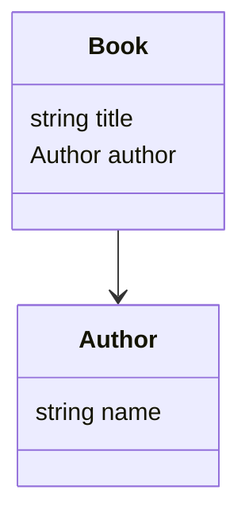

# Agent brief: JSONSchema-to-Mermaid

Purpose

- Provide a compact, human-friendly explanation of this repository's goal so an automated agent (or a new contributor) can quickly understand intent and act on tasks.

Project goal

- Convert JSON Schema (and YAML Schema variants) into Mermaid diagrams (class diagrams, entity relationship-like diagrams) to help visualize schema structure, relationships, and types.
- Support both single-file and multi-file schemas, resolve $ref references (local and file-based), and produce readable Mermaid output usable in documentation and README previews.

Primary inputs and outputs (contract)

- Inputs: JSON Schema or YAML files located in `src/main/resources` and arbitrary file paths (CLI). Accepts both single-file schemas and folders containing multiple schema files.
- Outputs: Mermaid diagram text (stdout or file), optionally CLI scripts placed under `build/scripts` for distribution, and test reports under `build/reports`.
- Error modes: malformed JSON/YAML, unresolved $ref, recursive references, unsupported schema features (like remote HTTP refs unless resolved beforehand). The tool should fail with informative messages and non-zero exit code.

How the agent (or a contributor) can help

- Improve/refactor/refine schema parsing and $ref resolution.
- Add new Mermaid diagram types (e.g., sequence or flow diagrams) or styling options.
- Harden CLI error handling and add more tests covering edge cases.
- Update documentation and add examples for README.

Quick usage (existing repo)

- The project is a Kotlin/Gradle project. Typical commands:

  - Build: `./gradlew :jsonschema-to-mermaid:build`
  - Run tests: `./gradlew :jsonschema-to-mermaid:test`
  - Run CLI (from built distribution or via `run` task`): see `src/main/kotlin/jsonschema_to_mermaid/App.kt` for entrypoint and args.

- Quickstart example (copyable): build the project, then run the packaged script or Gradle `run`. The CLI currently accepts one or more source schema paths followed by a destination path (the CLI prints Mermaid to stdout, so redirect to capture it).

  - Build the project:

```bash
./gradlew :jsonschema-to-mermaid:build
```

  - Run using the generated script (recommended after `build`):

```bash
# after a successful build, run the generated script and redirect stdout
jsonschema-to-mermaid/build/scripts/jsonschema-to-mermaid src/main/resources/bookstore/bookstore.schema.json bookstore.mmd > bookstore.mmd
```

  - Or run via Gradle (the CLI still prints to stdout; supply a dest arg then redirect):

```bash
./gradlew :jsonschema-to-mermaid:run --args="src/main/resources/bookstore/bookstore.schema.json bookstore.mmd" > bookstore.mmd
```

Minimal expected Mermaid example

- A tiny, concrete Mermaid snippet helps set expectations. Given a simple schema with a Book that references an Author, the tool should produce something like:



Key files and locations

- `src/main/kotlin/jsonschema_to_mermaid/` — main application and generators (`MermaidGenerator.kt`, `MermaidClassDiagramGenerator.kt`).
- `src/main/resources/` — sample schemas used by tests and examples (bookstore, core, invalid samples).
- `build/` — compiled artifacts, distributions, and test reports.

Design contract & expectations (2–3 bullets)

- Input -> parse -> model -> mermaid: The tool parses schema(s), maps them to an internal model (types, properties, links), then renders Mermaid text.
- CLI/Library duality: functionality should be available both as a CLI tool and as a library API for embedding.
- Tests must verify parsing, reference resolution, rendering output snippets, and error modes.

Representation decisions (stance)

- oneOf / anyOf / allOf: these combinators are semantics-heavy and don't map 1:1 to class diagrams. Recommended default approach (documented here so contributors are aligned):
  - Render each variant as its own box (class) and draw a labeled grouping node or a comment saying "oneOf"/"anyOf"/"allOf" with arrows to variants. That keeps diagrams readable while preserving the alternatives.
  - If variants are simple primitives (string/number/etc.), render them as typed properties with a qualifier (e.g., `value: string | number`) where appropriate.
  - Make this behavior configurable later (e.g., `--combine-oneof-as-union` flag).

- Recursive / circular `$ref`: avoid infinite expansion by detecting recursion during traversal. Recommended behavior:
  - Emit a forward/back reference (an edge pointing to the existing type) and add a short "(recursive)" note on the relationship.
  - Do not recursively inline definitions indefinitely; stop at first repeated type and reference it instead.

- Remote HTTP refs: by default treat unresolved remote refs as an error and fail fast with an informative message. Optionally support a resolver hook or pre-fetch stage in future work.

Edge cases to watch for

- Circular / recursive $ref references.
- JSON Schema features not mapped to Mermaid (oneOf/anyOf/allOf semantics) — decide on representation or fallback.
- Large schemas with many files and cross-file refs (performance & resolution order).
- Mixed YAML/JSON formats, non-standard extensions, or schemas using remote HTTP refs.

Contributor first-steps checklist (quick)

1. Fork & clone, then run the unit tests:

```bash
./gradlew :jsonschema-to-mermaid:test
```

2. Run a quick CLI conversion of the sample schema and verify output contains `class Book` or expected tokens:

```bash
./gradlew :jsonschema-to-mermaid:run --args="src/main/resources/bookstore/bookstore.schema.json bookstore.mmd" > /tmp/bookstore.mmd
# then inspect /tmp/bookstore.mmd
```

3. Add a small unit test under `src/test/kotlin` for any new parsing/resolution behavior (follow existing test patterns).
4. If changing rendering, include a snapshot-style assertion of a small Mermaid output to catch regressions.
5. Open a PR with a short description and link to the added/changed tests.
6. Optionally, update this brief if the project scope or behavior changes significantly.
