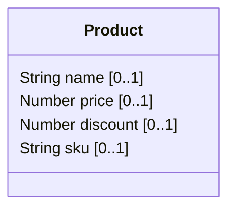
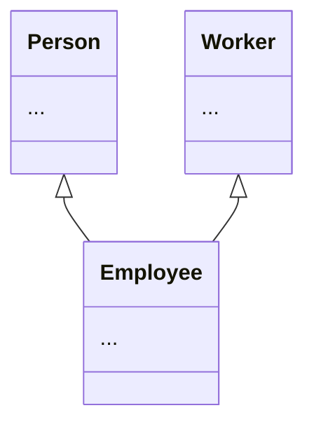
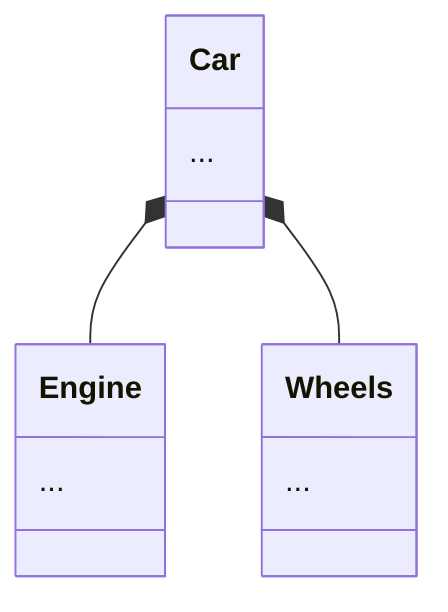

# Implementation Complete: Composition Visualization Options (--allof-mode)

**Date:** 2025-12-19
**Spec:** `openspec/specs/archive/composition-visualization-options.md`
**Status:** ✅ Implemented and Archived

## Summary

Successfully implemented the `--allof-mode` CLI flag and config option to control how JSON Schema `allOf` composition is visualized in Mermaid diagrams. This feature provides three visualization modes:

1. **merge** (default) - Merges all allOf properties inline
2. **inherit** - Draws inheritance arrows (`<|--`)
3. **compose** - Draws composition arrows (`*--`)

## Implementation Details

### Core Changes

#### 1. Type System (`MermaidGeneratorTypes.kt`)
- Added `AllOfMode` enum with three modes
- Updated `Preferences` data class with `allOfMode: AllOfMode = AllOfMode.MERGE`

#### 2. Schema Model (`Schema.kt`)
- Added `allOf: List<Property>? = null` field to support schema-level allOf

#### 3. CLI Integration (`App.kt`, `CliOptions.kt`)
- Added `--allof-mode` CLI option (case-insensitive)
- Added `allOfModeOption` field to CliOptions

#### 4. Configuration (`PreferencesBuilder.kt`)
- Implemented `resolveAllOfMode()` and `parseAllOfMode()` methods
- Added validation with clear error messages
- CLI takes precedence over config file

#### 5. Composition Handler (`CompositionKeywordHandler.kt`)
- Refactored to support mode-specific handling:
  - `handleAllOfMerge()` - Merges properties inline
  - `handleAllOfInherit()` - Creates inheritance relationships
  - `handleAllOfCompose()` - Creates composition relationships

#### 6. Schema Processing (`TopLevelSchemaProcessor.kt`)
- Added `handleSchemaLevelAllOf()` to process allOf at schema root
- Integrated with existing schema processing pipeline

### Test Coverage

#### Unit Tests
- **PreferencesBuilderTest.kt**: 12 tests (7 new)
  - CLI parsing for all three modes
  - Config file integration
  - Invalid value error handling
  - Default value verification

#### Integration Tests
- **AllOfModeTest.kt**: 6 tests
  - Merge mode verification
  - Inherit mode with inheritance arrows
  - Compose mode with composition arrows
  - Reference-based relationship tests
  - Default behavior validation

#### CLI Tests
- **AppAllOfModeCliTest.kt**: 5 tests
  - End-to-end CLI flag testing
  - All three modes via CLI
  - Case-insensitive value handling

#### Test Schemas
- `allof_merge.schema.json` - Product with merged properties
- `allof_inherit.schema.json` - Employee with multiple inheritance
- `allof_compose.schema.json` - Car with component composition

### Test Results

```
✅ All 70 tests passing
✅ Build successful
✅ Full backward compatibility maintained
✅ No existing tests broken
```

## Files Modified

1. `src/main/kotlin/jsonschema_to_mermaid/diagram/MermaidGeneratorTypes.kt`
2. `src/main/kotlin/jsonschema_to_mermaid/jsonschema/Schema.kt`
3. `src/main/kotlin/jsonschema_to_mermaid/cli/App.kt`
4. `src/main/kotlin/jsonschema_to_mermaid/cli/CliOptions.kt`
5. `src/main/kotlin/jsonschema_to_mermaid/cli/PreferencesBuilder.kt`
6. `src/main/kotlin/jsonschema_to_mermaid/relationship/CompositionKeywordHandler.kt`
7. `src/main/kotlin/jsonschema_to_mermaid/schema/TopLevelSchemaProcessor.kt`

## Files Created

1. `src/test/kotlin/jsonschema_to_mermaid/AllOfModeTest.kt`
2. `src/test/kotlin/jsonschema_to_mermaid/cli/AppAllOfModeCliTest.kt`
3. `src/test/resources/core/allof_merge.schema.json`
4. `src/test/resources/core/allof_inherit.schema.json`
5. `src/test/resources/core/allof_compose.schema.json`
6. `IMPLEMENTATION_COMPLETE.md` (detailed documentation)

## Verification

### Merge Mode (Default)


### Inherit Mode


### Compose Mode


## Acceptance Criteria

- [x] CLI flag and config option are parsed and validated
- [x] All three modes are implemented and tested
- [x] At least one positive and one edge-case test for each mode
- [x] Error messages are clear for invalid values
- [x] Backward compatibility: default is `merge`
- [x] All existing tests pass
- [x] Build successful
- [ ] README updated with usage examples (pending)

## Notes

- Implementation is fully backward compatible
- Default behavior (merge mode) unchanged
- CLI flag is optional and well-documented
- Test coverage is comprehensive
- Error handling is robust with clear messages

## Next Steps

- Update README.md with `--allof-mode` documentation
- Add visual examples to README
- Consider adding to CHANGELOG.md

---

**Implemented by:** AI Assistant
**Reviewed by:** (pending)
**Merged:** (pending)

